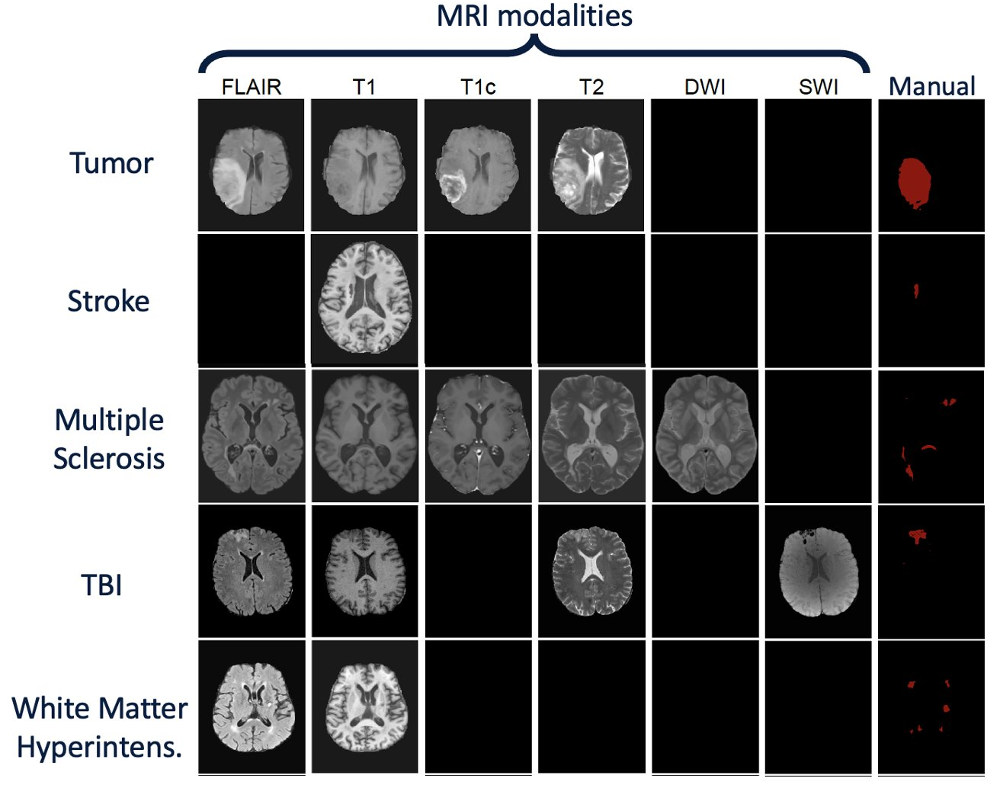
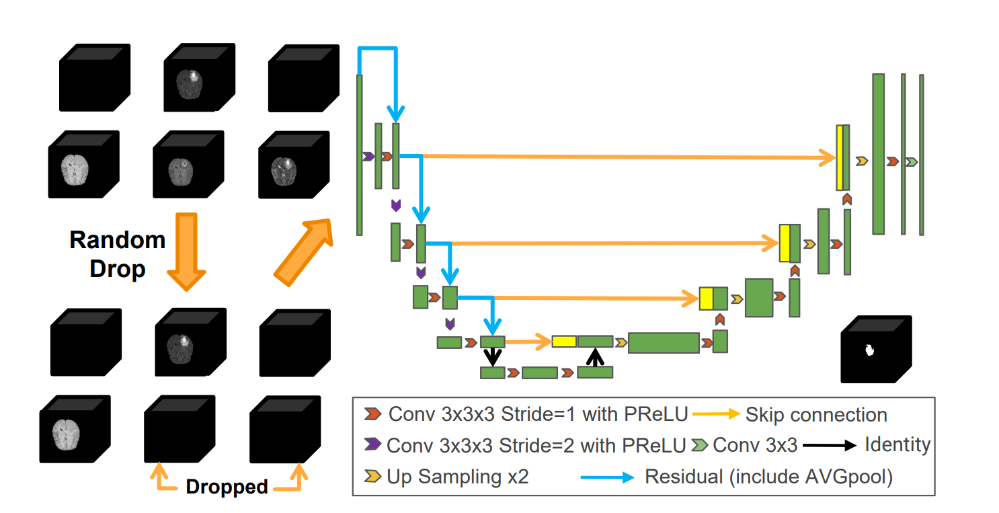

# Multi-Unet

This repository provides the implementation of the paper:

[Feasibility and benefits of joint learning from MRI databases with different brain diseases and modalities for segmentation](https://arxiv.org/pdf/2405.18511)  
Wentian Xu*, Matthew Moffat*, Thalia Seale, Ziyun Liang, Felix Wagner, Daniel Whitehouse, David Menon, Virginia Newcombe, Natalie Voets, Abhirup Banerjee, Konstantinos Kamnitsas 

In [MIDL](https://2024.midl.io/) (Medical Imaging with Deep Learning) 2024.

Want to train 1 model on multiple MRI databases with different brain lesions and sets of modalities?

<!--  -->


#### Try this simple process!!!
<!--  -->


## Setup
To install the codes and dependencies into a new conda environment, simply run the following:

```bash
git clone https://github.com/WenTXuL/multiunet_private.git
conda env create -f environment.yml
source activate multiunet
``` 
Alternatively, you may install the following dependencies manually: 

```
Python 3.10
Pytorch 1.11 cudatoolkit 11.3  (can be done by: conda install pytorch=1.11 torchvision torchaudio cudatoolkit=11.3 -c pytorch)
Monai 1.3.2
Numpy 1.26.4
Nibabel 5.2.1
```  

## Data


The databases used in the paper are shown as follow:

  

###### Public databases:

- [BRATS ( 2016+2017 decathlon )](http://medicaldecathlon.com/)
- [ATLAS 2.0](https://fcon_1000.projects.nitrc.org/indi/retro/atlas.html)
- [WMH_2017](https://wmh.isi.uu.nl/#_Data)
- [MSSEG_2016](https://www.nature.com/articles/s41598-018-31911-7)
- [ISLES_2015](https://www.isles-challenge.org/ISLES2015/)

Other databases used in our work:

TBI and Tumor_2 are data from our institutions that cannot be made publicly available currently. We can not publish them. However, you can try any databases you want with the following data preprocess pipeline.

#### Data preprocess  

1. For the databases **that contain skull** (e.g. ATLAS): we remove the skull using [ROBEX](https://www.nitrc.org/projects/robex) first.
2. For **all the databases**, we do **z-score intensity normalization** based on the mean and Standard deviation of the brain area. Then, for each case (patient), we **concatenate** all the 3D images of different modalities together into one **4D** image, and save them as one file.
3. We don't do registration, but we **flipped** the axis of the images in several databases (e.g. WMH, MSSEG) to make sure all the brains have similar orientations. Preprocess_flip.py contain the same functions as preprocess.py but it also flip the images.
4. For the databases that have **multi_class labels** (e.g. BRATS), we merge some classes to create binary labels. We show the corresponding  code for BRATS in merge_labels.py

## How to run

#### Quick test
If you only want to test our pretrained model on your database, you can preprocess your database with the previously mentioned preprocess pipeline and then simply run quick_test.py with command line
command line arguments are shown as follows:  
```--img_path``` The path of the folder that contains all the image files  
```--seg_path``` The path of the folder that contains all the label files  
```--modalities_to_test``` The modalities for testing (the index of the modalities for that input) using '_' to separate. if 0_1_2 for BRATS (FLAIR,T1,T1c,T2), it means test on FLAIR, T1, T1c  
```--channel_m``` The allocated channel index of the modalities in the test input (start from 0) Using '_' to separate. The pretrain model we provided (train on five databases) contains six modalities (PD, FLAIR, SWI, T1, T1C, T2). The corresponding channel indexes are PD:0 FLAIR:1 SWI:2 T1:3 T1C:4 T2:5. For example if you want to test the model on WMH (FLAIR, T1), --channel_m will be 1_3. If you have modalities that are not included in the pre-train, You can use the index of any unused channel for it and this modality in "--modalities_to_test".  
An example of quick test on WMH Database with all the available modalities:
```
python quick_test.py --img_path data/WMH/Images --seg_path data/WMH/Labels --modalities_to_test 0_1 --channel_m 1_3
```

#### Training

1. Change the database path in the config.py file (Database_config). Set the contained modalities for each database. Set the training size and total size of the databases. (In our work, we put all the samples in one folder. As a quick setting, We sorted the images with the file name and split training and testing databases depending on this order. i.e., use the first m images for training; m is the training size)  (When adding a new database, make sure that you add the database path. containing modalities, training size and total size. )
2. Change the training setting in the Training_config class of the config.py  (e.g. epoch,lr)
3. Run the train.py file with the command line

Command line arguments are shown as follow:  
```--device_id``` Allow to choose different GPUs for training  
```--datasets``` datasets for training, using '\_' to separate  
```--save_name``` File name for saving model weights and checkpoints  
```--random_drop_flag``` 0 or 1, 1 if random dropping modalities when training  


An example of training the model on BRATS and ATLAS with random dropping on modalities is shown below:
```
python train.py --device_id 1 --save_name test --datasets BRATS_ATLAS --randomly_drop 1
```


#### Finetuning
1. Change the database path in the config.py file. Set the contained modalities for each database. Set the training size and total size of the databases. (In our work, we put all the samples in one folder. As a quick setting, We sorted the images with the file name and split training and testing databases depending on this order. i.e., use the first m images for training; m is the training size)  (When adding a new database, make sure that you add the database path. containing modalities, training size and total size. )
2. Change training setting in the Finetune_config class of the config.py (e.g. epoch,lr)
3. Run the train_finetune.py file with the command line

Command line arguments are showing as follow:  
```--device_id``` Allow to choose different GPU for training  
```--datasets``` datasets for training, using '\_' to separate  
```--save_name``` File name for saving model weights and checkpoints  
```--random_drop_flag``` 0 or 1, 1 if random dropping modalities when training  
```--load_model_finetune_path``` The path of the pretrained model  
```--manual_channel_map``` The allocated channel index of the modalities(each channel) in the finetuning input (start from 0) Using '_' to separate. For example, 1_3 means the first modality in the finetuning input goes to the second channel of the model, and the second modality goes to the fourth channel of the model.  
```--modalities_when_trained``` modalities used for training the pre-train model using '\_' to separate  

An example of finetune ISLES on the model that pretrained on the five proposed databases is shown below. (DWI are being put into DP)
```
python train_finetune.py --device_id 1 --save_name test --datasets ISLES --randomly_drop 0 --load_model_finetune_path models/Train_BRATS_TBI_ATLAS_MSSEG_WMH.pth --manual_channel_map 1_3_5_0 --modalities_when_trained PD_FLAIR_SWI_T1_T1c_T2
```


#### Testing
1. Change the database path in config.py. Set the contained modalities for each database. Set the val_size of the test database. (This is only for testing, this allowed you to use part of the images for testing, We sorted the images with the file name and used the last n images for testing. n is the val_size.)
2. Change the setting in the Test_config Class of the config.py. (If you use a new database,  the allocated channel indexes need to be added to "model_channel_map" as explained in the code.)
3. Run the test_master.py file with the command line

Command line arguments are showing as follow:  
```--device_id``` Allow to choose different GPU for training  
```--datasets_to_test``` dataset for testing  
```--modalities_to_test``` The modalities for testing (the index of the modalities for that input), using '_' to separate if 0_1_2 for BRATS it would mean test on FLAIR, T1, T1c  
```--test_all_combinations``` 0 or 1 1 if testing on all possible modality combinations    

An example of test MSSEG (flair and T1) on the model that trains on the five proposed databases is shown below.  
```
python test.py --device_id 0 --datasets_to_test MSSEG --modalities_to_test 0_1 --test_all_combinations 0
```


